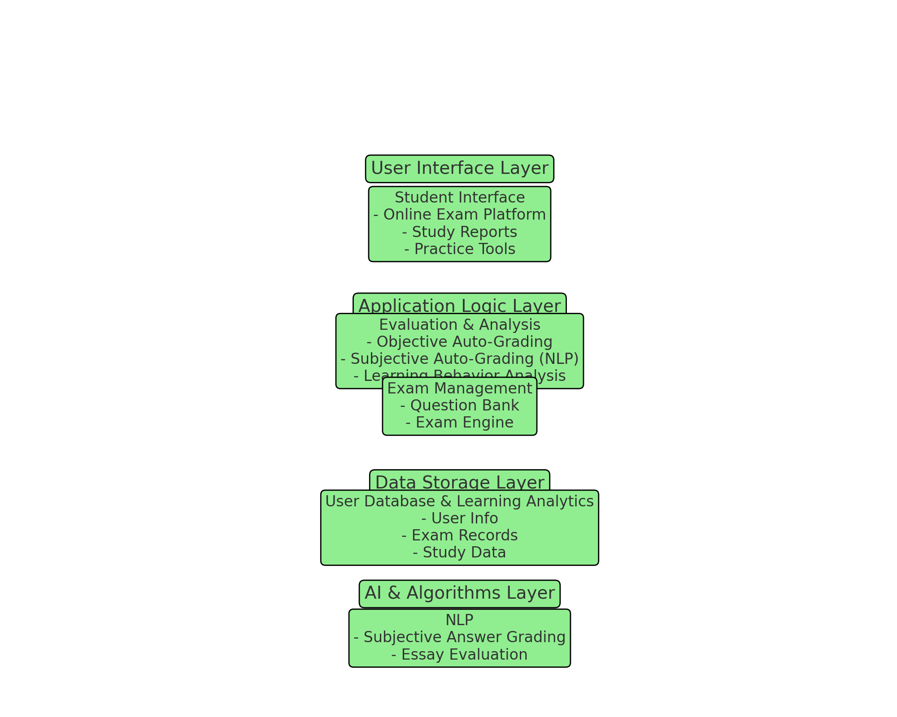

# AI-education(语文学习助手)

## intro

This project is a project based on a [course](https://github.com/InternLM/Tutorial) provided by InternLM.

It is a YuWen learning assistant that helps students quickly improve their scores in subjective questions and essays.

## infrastructure

学生自助学习系统，旨在提高语文分数。系统(简化版)包含的模块：

* 用户接口层
* 应用逻辑层
* 数据存储层
* AI算法层

## 模块说明

